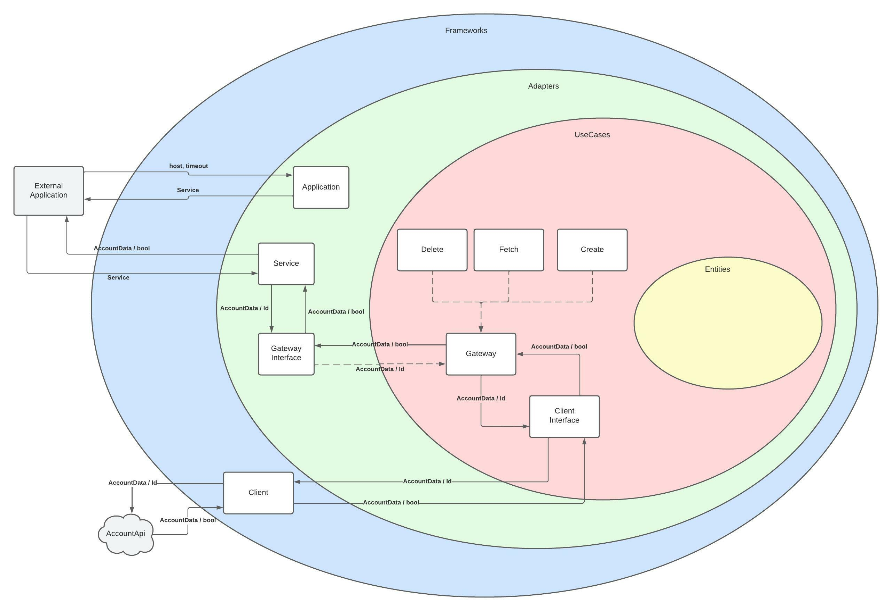
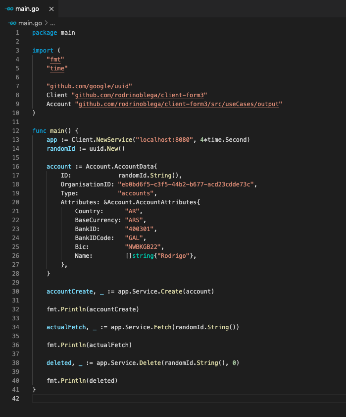

# Form3 Take Home Exercise

```
Owner: Rodrigo Noblega
Note: Exercise done with no previous knowledge of Golang
```


## Objective

Client library in Go to access our fake account API with `Create`, `Fetch`, and `Delete` operations

## Project structure

This project was structured based on the concept of [Clean Architecture](https://blog.cleancoder.com/uncle-bob/2012/08/13/the-clean-architecture.html) and following The dependency rule that says that source code dependencies can only point inwards. Nothing in an inner circle can know anything at all about something in an outer circle.

The implementation of this code was made using TDD (Test driven development), clean code and simple design.

Project structure diagram: 



```Note: We have an Instrumentation class that handles errors. Nowadays we only log the error. If we want to add, for example, a track tool in order to register errors, we can do it here withou modifying any code.```


## Using the client

In order to use de client you should:

- Execute `go get github.com/rodrinoblega/client-form3` to download de go module
- Import `github.com/rodrinoblega/client-form` and generate a new service with a URL and a timeout
- Import `github.com/rodrinoblega/client-form3/src/useCases/output` to be able to handle the client's inputs and outputs through Account dto
- Execute `Create`, `Fetch` or `Delete` from the service
- Example:



