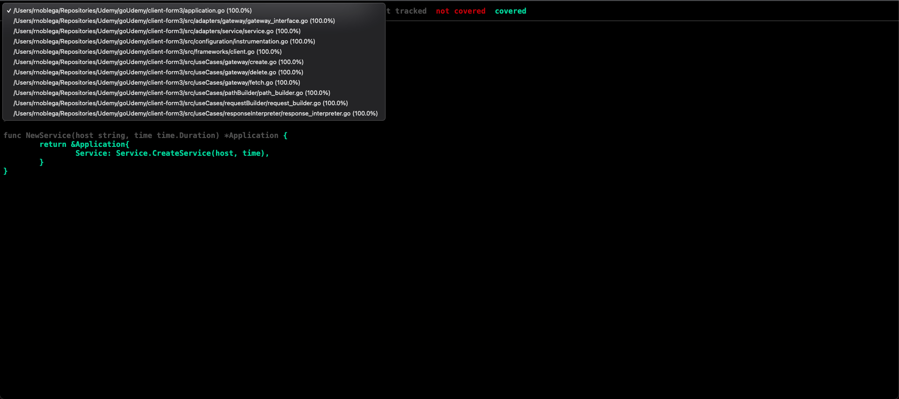

# Form3 Take Home Exercise

```
Owner: Rodrigo Noblega
Note: Exercise done with no previous knowledge of Golang
```


## Objective

Client library in Go to access a fake account API with `Create`, `Fetch`, and `Delete` operations


## Project structure

This project was structured based on the concept of [Clean Architecture](https://blog.cleancoder.com/uncle-bob/2012/08/13/the-clean-architecture.html) and following "The Dependency Rule" that says that source code dependencies can only point inwards. Nothing in an inner circle can know anything at all about something in an outer circle.

The implementation of this code was made using TDD (Test driven development), clean code and simple design.

Project structure diagram: 


```
Note: We abstracted the implementation of the HTTP client into a struct Client in the framework layer. 
We did this because, if in the future we want to change the implementation, 
we would only modify it in one single place.
```

```
Note 2: We have an Instrumentation class that handles errors. Nowadays we only log the error. 
If we want to add, for example, a tracking tool in order to register errors, 
we can do it here without modifying any code.
```


## Using the client

In order to use the client you should:

- Execute `go get github.com/rodrinoblega/client-form3` to download de go module
- Import `github.com/rodrinoblega/client-form` and generate a new service with an URL and a timeout
- Import `github.com/rodrinoblega/client-form3/src/useCases/output` to be able to handle the client's inputs and outputs through Account dto
- Execute `Create`, `Fetch` or `Delete` from the service
- Example:


## Test

The implementation was made following TDD (Test driven development).

Types of test:
* Unit Tests: Used to test packages individually
* Functional tests: Used to test the entire application flow 


We can find a 100% of code coverage:


To run the test locally, you should run:

`docker-compose up` to be able to access the account api

`go test -v -coverpkg ./... ./... -coverprofile cover.out` to run all the application's test

`go tool cover -html=cover.out` to see the code coverage report

```
NOTE: When you run docker-compose up, all the application's tests are executed
```


## Questions

* [rnoblega@gmail.com](rnoblega@gmail.com)

